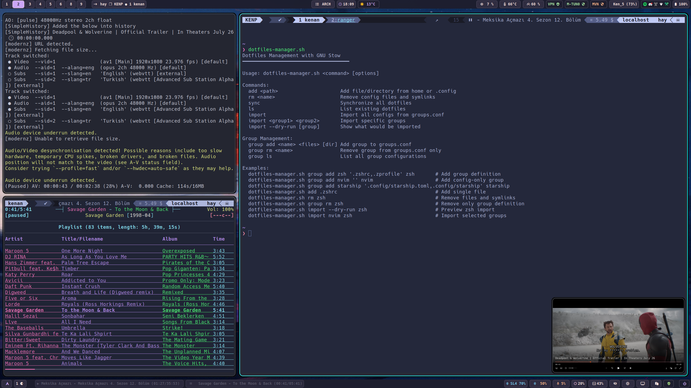

# Dotfiles 🏠

Bu repo, Arch Linux sistemim için yapılandırma dosyalarımı (dotfiles) içerir. GNU Stow kullanılarak yönetilmektedir.

<div align="center">
  
</div>

## 📁 Mevcut Yapılandırmalar

- [x] `alacritty/` - Alacritty terminal emülatörü yapılandırması
- [x] `fish/` - Fish shell yapılandırması
- [x] `kitty/` - Kitty terminal emülatörü yapılandırması
- [x] `mpv/` - MPV medya oynatıcı yapılandırması

## 🔜 Yakında Eklenecekler

- [ ] `bin/` - Kişisel script ve yardımcı programlar
- [ ] `hypr/` - Hyprland pencere yöneticisi yapılandırması
- [ ] `nvim/` - Neovim editör yapılandırması
- [ ] `ranger/` - Ranger dosya yöneticisi yapılandırması
- [ ] `rofi/` - Rofi uygulama başlatıcı yapılandırması
- [ ] `sesh/` - Sesh oturum yöneticisi yapılandırması
- [ ] `tmux/` - Tmux terminal multiplexer yapılandırması
- [ ] `zsh/` - Zsh shell yapılandırması
- [ ] `waybar/` - Wayland bar yapılandırması
- [ ] `mako/` - Notification daemon yapılandırması

## 🚀 Hızlı Başlangıç

### Ön Gereksinimler

Bu dotfiles yapılandırması Arch Linux için optimize edilmiştir.

```bash
# Arch Linux için gerekli paketler
sudo pacman -S git stow
```

### Kurulum

1. Repoyu klonlayın:
```bash
git clone git@github.com:kenanpelit/dotfiles.git ~/.dotfiles
cd ~/.dotfiles
```

2. Make kullanarak kurulum yapın:
```bash
make install  # Tüm yapılandırmaları kurar
```

Ya da tek bir programın yapılandırmasını kurmak için:
```bash
stow alacritty  # Sadece alacritty yapılandırmasını kurar
```

## 🔧 Yönetim

### Yapılandırma Kaldırma
```bash
stow -D alacritty  # alacritty yapılandırmasını kaldırır
# veya
make uninstall  # Tüm yapılandırmaları kaldırır
```

### Güncelleme
```bash
cd ~/.dotfiles
git pull
make reinstall  # Tüm yapılandırmaları yeniden yükler
```

## 📝 Yeni Yapılandırma Ekleme

Yeni bir program için yapılandırma eklemek:

1. Yeni dizin oluşturun:
```bash
mkdir yeni_program
```

2. Yapılandırma dosyalarını doğru yol yapısıyla yerleştirin:
```bash
yeni_program/
└── .config/
    └── yeni_program/
        └── config
```

3. Stow ile bağlayın:
```bash
stow yeni_program
```

## ⚙️ Makefile Komutları

```bash
make install    # Tüm yapılandırmaları kurar
make uninstall  # Tüm yapılandırmaları kaldırır
make reinstall  # Tüm yapılandırmaları yeniden yükler
```

## 📜 Lisans

Bu repo MIT lisansı altında dağıtılmaktadır.
